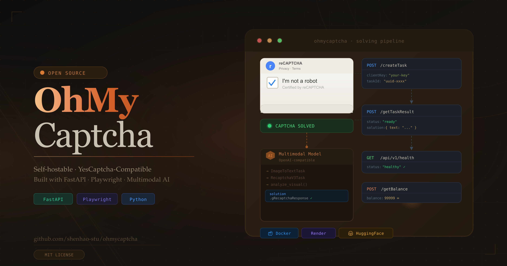
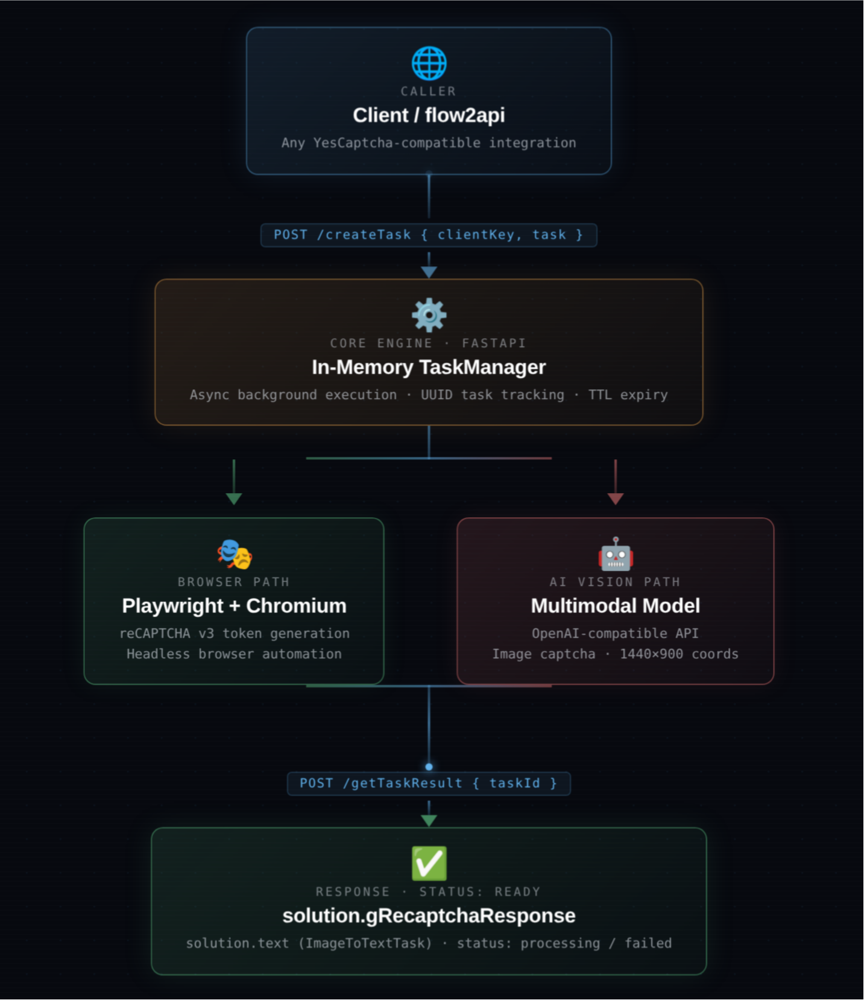

<p align="center">
  
  <br/>
  
  
  
  
  
  
</p>

<h1 align="center">🧩 CaptchAI</h1>

<p align="center">
  <strong>Self-hostable YesCaptcha-style captcha solver for <a href="https://github.com/TheSmallHanCat/flow2api">flow2api</a> and similar integrations</strong>
  <br/>
  <em>19 task types · reCAPTCHA v2/v3 · hCaptcha · Cloudflare Turnstile · Image Classification</em>
</p>

<p align="center">
  <a href="#-quick-start">Quick Start</a> •
  <a href="#-architecture">Architecture</a> •
  <a href="#-task-types">Task Types</a> •
  <a href="#-deployment">Deployment</a> •
  <a href="#-development">Development</a>
</p>

<p align="center">
  <a href="README.zh-CN.md">中文说明</a> •
  <a href="https://captchai-org.github.io/captchai/">Documentation</a> •
  <a href="https://captchai-org.github.io/captchai/deployment/render/">Render Guide</a> •
  <a href="https://captchai-org.github.io/captchai/deployment/huggingface/">Hugging Face Guide</a>
</p>

<p align="center">
  
</p>

---

## ✨ What Is This?

**CaptchAI** is a self-hosted captcha-solving service exposing a **YesCaptcha-style async API** with **19 supported task types**. Designed as a third-party captcha solver for **flow2api** and systems that expect `createTask` / `getTaskResult` semantics.

| Capability | Details |
|-----------|---------|
| **Browser automation** | Playwright + Chromium for reCAPTCHA v2/v3, hCaptcha, Cloudflare Turnstile |
| **Image recognition** | Local multimodal model (Qwen3.5-2B via SGLang) for image captcha analysis |
| **Image classification** | Local vision model for HCaptcha, reCAPTCHA v2, FunCaptcha, AWS grid classification |
| **API compatibility** | Full YesCaptcha `createTask`/`getTaskResult`/`getBalance` protocol |
| **Deployment** | Local, Render, Hugging Face Spaces with Docker support |

---

## 📦 Quick Start

```bash
python -m venv .venv && source .venv/bin/activate
pip install -r requirements.txt
playwright install --with-deps chromium

# Local model (self-hosted via SGLang)
export LOCAL_BASE_URL="http://localhost:30000/v1"
export LOCAL_MODEL="Qwen/Qwen3.5-2B"

# Cloud model (remote API)
export CLOUD_BASE_URL="https://your-openai-compatible-endpoint/v1"
export CLOUD_API_KEY="your-api-key"
export CLOUD_MODEL="gpt-5.4"

export CLIENT_KEY="your-client-key"
python main.py
```

Verify with:

```bash
curl http://localhost:8000/api/v1/health
```

---

## 🏗 Architecture

<p align="center">
  
</p>

**Core components:**

- **FastAPI** — HTTP API with YesCaptcha protocol
- **TaskManager** — async in-memory task queue with 10-min TTL
- **RecaptchaV3Solver** — Playwright-based reCAPTCHA v3/Enterprise token generation
- **RecaptchaV2Solver** — Playwright-based reCAPTCHA v2 checkbox solving
- **HCaptchaSolver** — Playwright-based hCaptcha solving
- **TurnstileSolver** — Playwright-based Cloudflare Turnstile solving
- **CaptchaRecognizer** — Argus-inspired multimodal image analysis
- **ClassificationSolver** — Vision model-based image classification

---

## 🧠 Task Types

### Browser-based solving (12 types)

| Category | Task Types | Solution Field |
|----------|-----------|----------------|
| reCAPTCHA v3 | `RecaptchaV3TaskProxyless`, `RecaptchaV3TaskProxylessM1`, `RecaptchaV3TaskProxylessM1S7`, `RecaptchaV3TaskProxylessM1S9` | `gRecaptchaResponse` |
| reCAPTCHA v3 Enterprise | `RecaptchaV3EnterpriseTask`, `RecaptchaV3EnterpriseTaskM1` | `gRecaptchaResponse` |
| reCAPTCHA v2 | `NoCaptchaTaskProxyless`, `RecaptchaV2TaskProxyless`, `RecaptchaV2EnterpriseTaskProxyless` | `gRecaptchaResponse` |
| hCaptcha | `HCaptchaTaskProxyless` | `gRecaptchaResponse` |
| Cloudflare Turnstile | `TurnstileTaskProxyless`, `TurnstileTaskProxylessM1` | `token` |

### Image recognition (3 types)

| Task Type | Solution Field |
|-----------|----------------|
| `ImageToTextTask` | `text` (structured JSON) |
| `ImageToTextTaskMuggle` | `text` |
| `ImageToTextTaskM1` | `text` |

### Image classification (4 types)

| Task Type | Solution Field |
|-----------|----------------|
| `HCaptchaClassification` | `objects` / `answer` |
| `ReCaptchaV2Classification` | `objects` |
| `FunCaptchaClassification` | `objects` |
| `AwsClassification` | `objects` |

---

## 🔌 API Surface

| Endpoint | Purpose |
|----------|---------|
| `POST /createTask` | Create an async captcha task |
| `POST /getTaskResult` | Poll task execution result |
| `POST /getBalance` | Return compatibility balance |
| `GET /api/v1/health` | Health and service status |

### Example: reCAPTCHA v3

```bash
curl -X POST http://localhost:8000/createTask \
  -H "Content-Type: application/json" \
  -d '{
    "clientKey": "your-client-key",
    "task": {
      "type": "RecaptchaV3TaskProxyless",
      "websiteURL": "https://antcpt.com/score_detector/",
      "websiteKey": "6LcR_okUAAAAAPYrPe-HK_0RULO1aZM15ENyM-Mf",
      "pageAction": "homepage"
    }
  }'
```

### Example: hCaptcha

```bash
curl -X POST http://localhost:8000/createTask \
  -H "Content-Type: application/json" \
  -d '{
    "clientKey": "your-client-key",
    "task": {
      "type": "HCaptchaTaskProxyless",
      "websiteURL": "https://example.com",
      "websiteKey": "hcaptcha-site-key"
    }
  }'
```

### Example: Cloudflare Turnstile

```bash
curl -X POST http://localhost:8000/createTask \
  -H "Content-Type: application/json" \
  -d '{
    "clientKey": "your-client-key",
    "task": {
      "type": "TurnstileTaskProxyless",
      "websiteURL": "https://example.com",
      "websiteKey": "turnstile-site-key"
    }
  }'
```

### Example: Image classification

```bash
curl -X POST http://localhost:8000/createTask \
  -H "Content-Type: application/json" \
  -d '{
    "clientKey": "your-client-key",
    "task": {
      "type": "ReCaptchaV2Classification",
      "image": "<base64-encoded-image>",
      "question": "Select all images with traffic lights"
    }
  }'
```

### Poll result

```bash
curl -X POST http://localhost:8000/getTaskResult \
  -H "Content-Type: application/json" \
  -d '{"clientKey": "your-client-key", "taskId": "uuid-from-createTask"}'
```

---

## ⚙️ Configuration

### Model backends

CaptchAI uses two model backends — a **local model** for image tasks and a **cloud model** for complex reasoning:

| Variable | Description | Default |
|----------|-------------|---------|
| `LOCAL_BASE_URL` | Local inference server (SGLang/vLLM) | `http://localhost:30000/v1` |
| `LOCAL_API_KEY` | Local server API key | `EMPTY` |
| `LOCAL_MODEL` | Local model name | `Qwen/Qwen3.5-2B` |
| `CLOUD_BASE_URL` | Cloud API base URL | External endpoint |
| `CLOUD_API_KEY` | Cloud API key | unset |
| `CLOUD_MODEL` | Cloud model name | `gpt-5.4` |

### General

| Variable | Description | Default |
|----------|-------------|---------|
| `CLIENT_KEY` | Client authentication key | unset |
| `CAPTCHA_RETRIES` | Retry count | `3` |
| `CAPTCHA_TIMEOUT` | Model timeout (seconds) | `30` |
| `CAPTCHA_MAX_CONCURRENCY` | Max concurrent browser solves | `4` |
| `CAPTCHA_SOLVE_TIMEOUT` | Per-task wall-clock budget (seconds) | `180` |
| `BROWSER_HEADLESS` | Headless Chromium | `true` |
| `BROWSER_TIMEOUT` | Page load timeout (seconds) | `30` |
| `BROWSER_RUNTIME` | Browser runtime: `chromium` (stock) \| `rebrowser` \| `camoufox` | `chromium` |
| `BROWSER_RUNTIME_STRICT` | Fail startup instead of silently degrading to stock Chromium when the requested hardened runtime is unavailable (recommended for enterprise hCaptcha) | `false` |
| `CAMOUFOX_HUMANIZE` | Enable Camoufox's built-in human-like cursor motion (only when `BROWSER_RUNTIME=camoufox`) | `true` |
| `CAMOUFOX_BLOCK_WEBRTC` | Block WebRTC under Camoufox to prevent an IP leak past the proxy | `true` |
| `CAMOUFOX_OS` | Optional OS pin for Camoufox's spoofed fingerprint (comma list of `windows`/`macos`/`linux`; empty = randomise) | unset |
| `VISION_STITCH_GRID` | Compose multi-tile grid challenges into one montage image per model call (~N× cheaper tokens/latency); set `false` for max per-tile resolution | `true` |
| `PROXY_MAX_GB` | Per-proxy bandwidth quota in GB before the proxy is burned (removed from rotation); `0` = unlimited | `0` |
| `SERVER_HOST` | Bind host | `0.0.0.0` |
| `SERVER_PORT` | Bind port | `8000` |

### Proxy & User-Agent binding (Turnstile / hCaptcha / reCAPTCHA)

Cloudflare and Google (and hCaptcha **Enterprise**) bind tokens to the **egress IP** and **User-Agent** used at solve time. For real (non-test) sitekeys, pass a proxy and reuse the returned `solution.userAgent` (and the same proxy IP) when submitting the token downstream.

The solution also echoes the **egress identity** so you can align an IP-bound submit even when the service solved on its own pool proxy:

- `solution.proxyKind` — `proxyless` \| `pool_proxy` \| `task_proxy`
- `solution.egressServer` — the credential-free proxy gateway (`scheme://host:port`) that minted the token, or `null` for proxyless solves. Route your downstream request (e.g. the Stripe card-binding call) through this same egress when the token is IP-bound.

> **Enterprise hCaptcha (e.g. Stripe):** supply your own proxy (`egress=task` / proxy fields) so the solve and your downstream submit share one IP, or route your submit through the returned `egressServer`. A token minted on a different IP than the submit will be rejected. Run the hardened **Camoufox** runtime (`BROWSER_RUNTIME=camoufox` + `BROWSER_RUNTIME_STRICT=true`; install per `requirements.txt`) — stock Chromium's automation signals are trivially flagged by enterprise detectors.

```jsonc
"task": {
  "type": "TurnstileTaskProxyless",
  "websiteURL": "https://example.com",
  "websiteKey": "0x4AAA...",
  "action": "login",          // if the widget sets one
  "cData": "…",               // if the widget sets one
  "userAgent": "Mozilla/5.0 … Chrome/131.0.0.0 Safari/537.36",
  "proxyType": "http", "proxyAddress": "1.2.3.4", "proxyPort": 8080,
  "proxyLogin": "user", "proxyPassword": "pass"
}
```

> Legacy vars (`CAPTCHA_BASE_URL`, `CAPTCHA_API_KEY`, `CAPTCHA_MODEL`, `CAPTCHA_MULTIMODAL_MODEL`) are supported as fallbacks.

---

## 🚀 Deployment

- [Local model (SGLang)](https://captchai-org.github.io/captchai/deployment/local-model/) — deploy Qwen3.5-2B locally
- [Render deployment](https://captchai-org.github.io/captchai/deployment/render/)
- [Hugging Face Spaces deployment](https://captchai-org.github.io/captchai/deployment/huggingface/)
- [Full documentation](https://captchai-org.github.io/captchai/)

---

## ✅ Test Target

This service is validated against the public reCAPTCHA v3 score detector:

- URL: `https://antcpt.com/score_detector/`
- Site key: `6LcR_okUAAAAAPYrPe-HK_0RULO1aZM15ENyM-Mf`

---

## ⚠️ Limitations

- Tasks are stored **in memory** with a 10-minute TTL
- `minScore` is accepted for compatibility but not enforced
- Browser-based solving depends on environment, IP reputation, and target-site behavior
- Image classification quality depends on the vision model used
- Not all commercial captcha-service features are replicated

---

## 📢 Disclaimer

> **This project is intended for legitimate research, security testing, and educational purposes only.**

- CaptchAI is a self-hostable tool. You are solely responsible for how you deploy and use it.
- CAPTCHA systems exist to protect services from abuse. **Do not use this tool to bypass CAPTCHAs on websites or services without explicit permission from the site owner.**
- Unauthorized automated access to third-party services may violate their Terms of Service, and may be illegal under applicable laws (e.g., the Computer Fraud and Abuse Act, GDPR, or equivalent legislation in your jurisdiction).
- The authors and contributors of this project **accept no liability** for any misuse, legal consequences, or damages arising from the use of this software.
- By using this software, you agree that you are solely responsible for ensuring your usage complies with all relevant laws and terms of service.

---

## 🔧 Development

```bash
pytest tests/
npx pyright
python -m mkdocs build --strict
```

---

## Star History

[](https://www.star-history.com/#captchai-org/captchai&Date)

---

## 📄 License

[MIT](LICENSE) — use freely, modify openly, deploy carefully.

See [DISCLAIMER.md](DISCLAIMER.md) for full terms of use and liability limitations.
